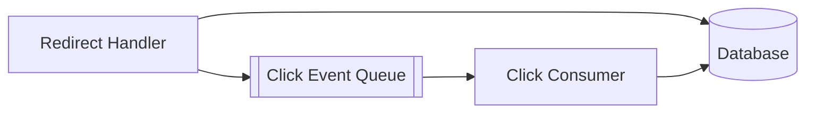
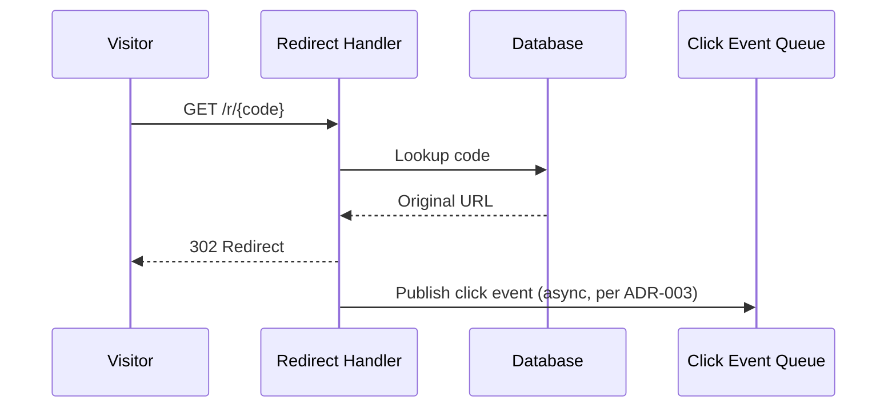

# Worked example: Mermaid Diagram Artifacts — TeamLink (continued)

Derived from architecture-design v1.0 (see its worked example). Notice
there's no diagram specification to read — these two diagrams were
*derived* by reading the architecture document's actual content: a
component diagram from Section 9's components, and a request-flow
sequence from Section 10's redirect flow description. Section 14
(Caching) and Section 15 (Messaging beyond the single click queue) were
marked Not Applicable / minimal in the architecture document, so no
caching or broader event-architecture diagram was produced — that's a
deliberate omission, not an oversight.

## Output layout

```
<project-root>/mermaid-diagrams/
  v1.0/
    01-component-architecture.mmd
    02-request-flow.mmd
    index.md
  v1.0.data.json
  v1.0.envelope.json
  LATEST.json
```

## 01-component-architecture.mmd

Derived from Section 9's `components` array.



## 02-request-flow.mmd

Derived from the redirect flow narrative under Section 10 (Request Flows)
and ADR-003.



## v1.0.data.json

```json
{
  "document_id": "MERMAID-TEAMLINK-001",
  "product": "TeamLink URL Shortener",
  "version": "1.0",
  "created": "2026-01-17",
  "input_document": {"type": "architecture-design", "version": "1.0", "validation": "PASS"},
  "status": "READY",
  "mvp": {"number": 1, "is_final": false},
  "diagrams": [
    {
      "filename": "01-component-architecture.mmd",
      "type": "container-architecture",
      "shows": "The Redirect Handler and Click Consumer components and their data/queue dependencies, from architecture-design Section 9.",
      "source": "native",
      "validated": false
    },
    {
      "filename": "02-request-flow.mmd",
      "type": "sequence-diagram",
      "shows": "The redirect path through async click-event publication, from architecture-design Section 10 and ADR-003.",
      "source": "native",
      "validated": false
    }
  ],
  "limitations": [
    "No Mermaid MCP tool or local mmdc install was available in this session; both diagrams were generated natively and only manually reviewed for syntax, not tool-validated.",
    "No caching or system-context diagram was produced: architecture-design Section 14 (Caching) is Not Applicable, and Section 5 (System Context) describes no external dependencies substantial enough to warrant a separate diagram beyond what the component diagram already shows."
  ]
}
```

Notice the second `limitations` entry: it explicitly explains *why* fewer
diagrams were produced than a maximal reading of the diagram-type list
might suggest — that's the honest, expected outcome of deriving diagrams
from content rather than filling out every possible type.
