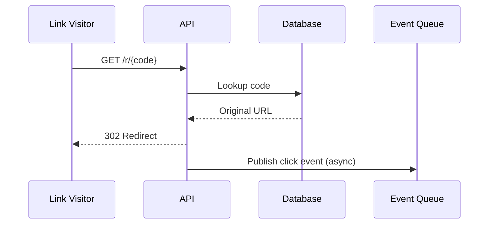
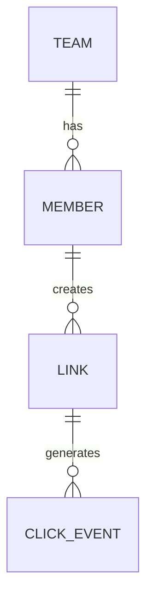

# Worked example: Mermaid Diagram Artifacts — TeamLink (continued)

Derived from architecture-design v1.0's Mermaid Diagram Specification,
which asked for exactly two diagrams (not all eight types — only the ones
this particular design actually warrants).

## Output layout

```
<project-root>/mermaid-diagrams/
  v1.0/
    01-request-flow.mmd
    02-entity-relationship.mmd
    index.md
  v1.0.data.json
  v1.0.envelope.json
  LATEST.json
```

`document_path` in the envelope is the directory `<project-root>/mermaid-diagrams/v1.0/`,
not a single file — this is the one stage where that's true.

## 01-request-flow.mmd



## 02-entity-relationship.mmd



## v1.0.data.json

```json
{
  "document_id": "MERMAID-TEAMLINK-001",
  "product": "TeamLink URL Shortener",
  "version": "1.0",
  "created": "2026-01-17",
  "input_document": {"type": "architecture-design", "version": "1.0", "validation": "PASS"},
  "status": "READY",
  "mvp": {"number": 1, "is_final": false},
  "diagrams": [
    {
      "filename": "01-request-flow.mmd",
      "type": "sequence-diagram",
      "shows": "The redirect path from visitor click through async click-event publication, per architecture-design section 10.",
      "source": "native",
      "validated": false
    },
    {
      "filename": "02-entity-relationship.mmd",
      "type": "entity-relationship",
      "shows": "Team/Member/Link/ClickEvent relationships from the data model in section 12.",
      "source": "native",
      "validated": false
    }
  ],
  "limitations": [
    "No Mermaid MCP tool or local mmdc install was available in this session; both diagrams were generated natively and only manually reviewed for syntax, not tool-validated."
  ]
}
```

Notice `"validated": false` and the honest limitations entry — that's the
"report limitations" step of the workflow, not a failure. If an MCP tool or
`mmdc` had been available, `source` would say `"mcp"` and `"validated"`
would be `true` for whichever diagrams it actually checked.
