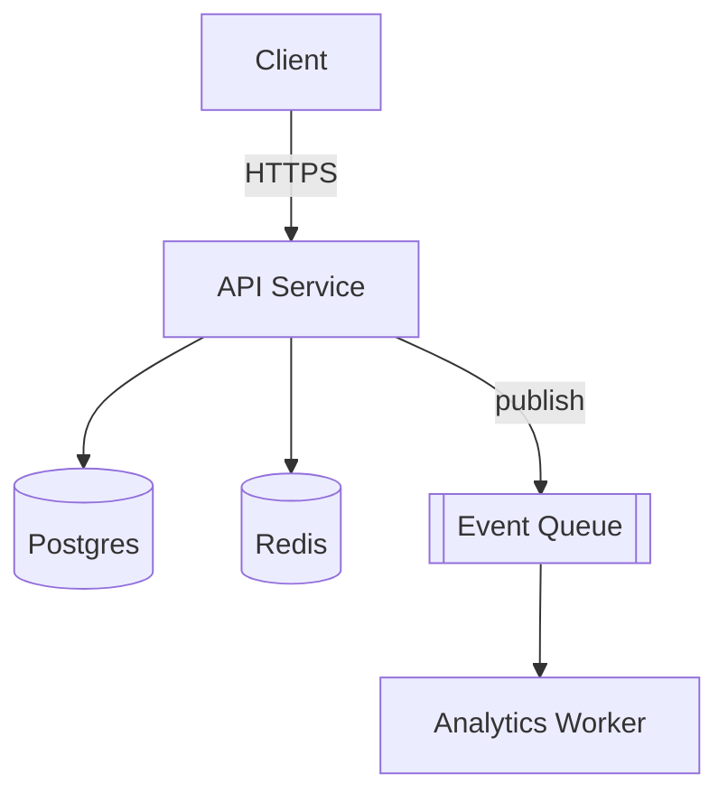
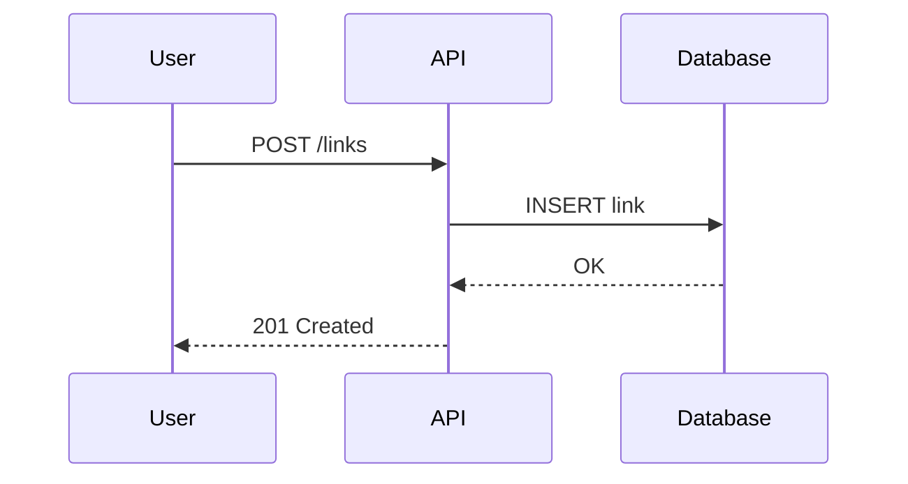
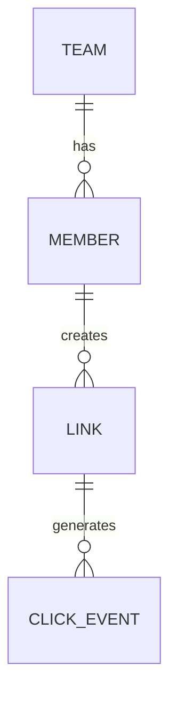
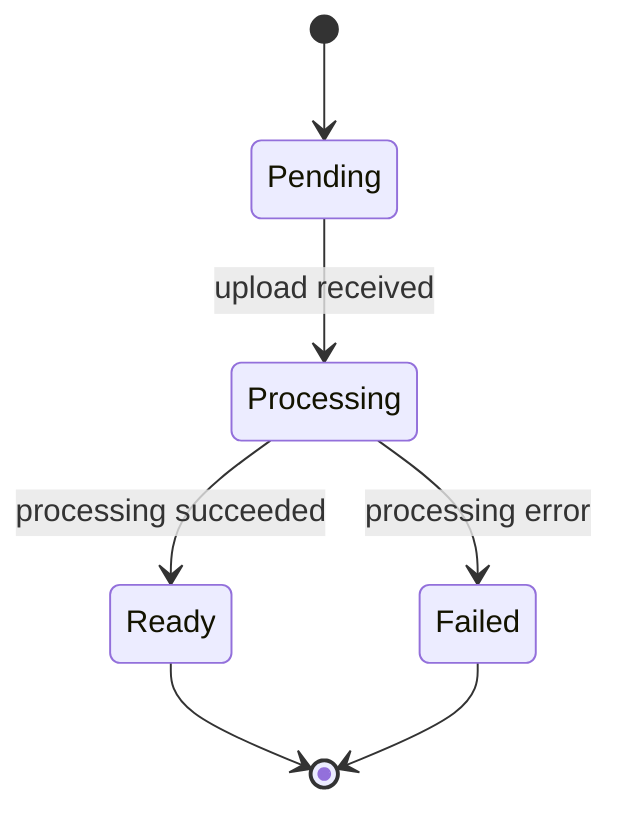

# Mermaid syntax quick reference (native-generation fallback)

Use this when no MCP Mermaid tool is available. Keep syntax simple and
widely compatible rather than using newer/less common features that some
renderers don't support.

## Component / flowchart

- `-->` solid arrow, `-.->` dashed, `-->|label|` for a labeled edge
- `[(...)]` for databases/stores, `[[...]]` for queues, `[...]` for generic
  nodes, `{...}` for decisions

## Sequence diagram

- `->>` solid call, `-->>` dashed return
- `activate`/`deactivate` to show lifelines if the sequence has concurrent
  actors worth highlighting

## Entity-relationship diagram

- `||--o{` one-to-many, `||--||` one-to-one, `}o--o{` many-to-many

## State diagram

