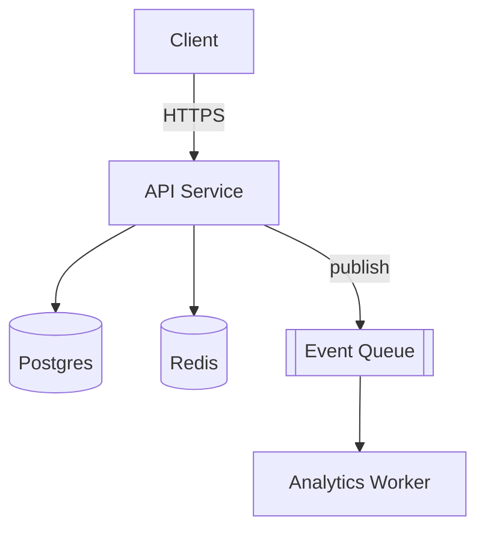
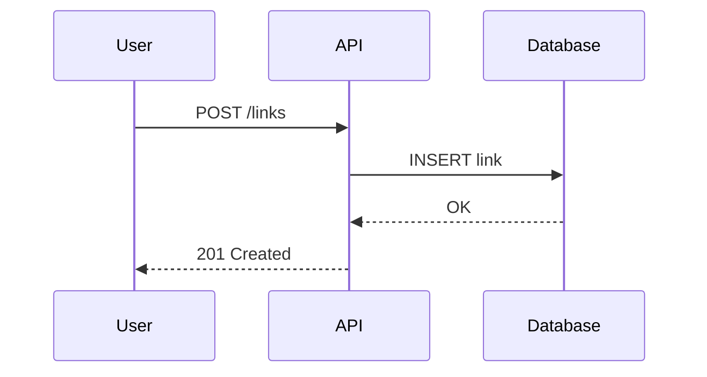
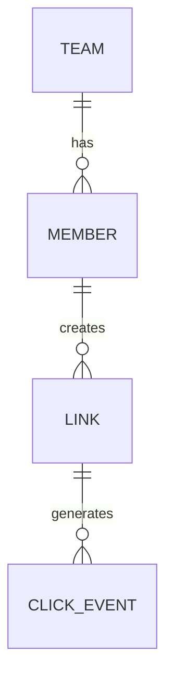
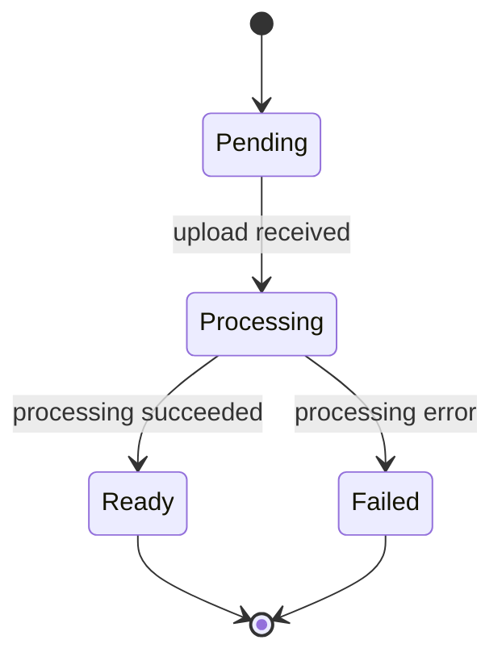
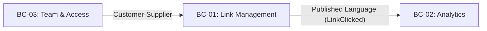

# Mermaid syntax quick reference (native-generation fallback)

Use this when no MCP Mermaid tool is available. Keep syntax simple and
widely compatible rather than using newer/less common features that some
renderers don't support.

## Component / flowchart

- `-->` solid arrow, `-.->` dashed, `-->|label|` for a labeled edge
- `[(...)]` for databases/stores, `[[...]]` for queues, `[...]` for generic
  nodes, `{...}` for decisions

## Sequence diagram

- `->>` solid call, `-->>` dashed return
- `activate`/`deactivate` to show lifelines if the sequence has concurrent
  actors worth highlighting

## Entity-relationship diagram

- `||--o{` one-to-many, `||--||` one-to-one, `}o--o{` many-to-many

## State diagram

## Context map (approximated as a labeled flowchart)

Mermaid has no dedicated diagram type for DDD context maps — render it as
a flowchart with each bounded context as a node and each relationship as
a labeled edge carrying the pattern name from architecture-design's
Context Map section (Partnership, Shared Kernel, Customer-Supplier,
Conformist, Anticorruption Layer, Open Host Service, Published Language,
Separate Ways):

Keep edge labels short — the pattern name plus, in parentheses, the
concrete mechanism (a domain event name, a shared table, etc.) if there's
room. Don't try to show aggregates or tactical detail on this diagram;
that's what an entity-relationship diagram is for.
