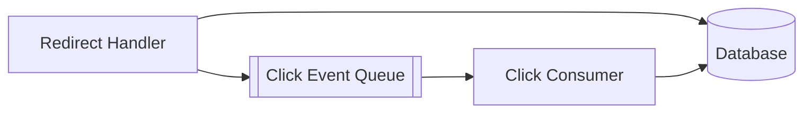
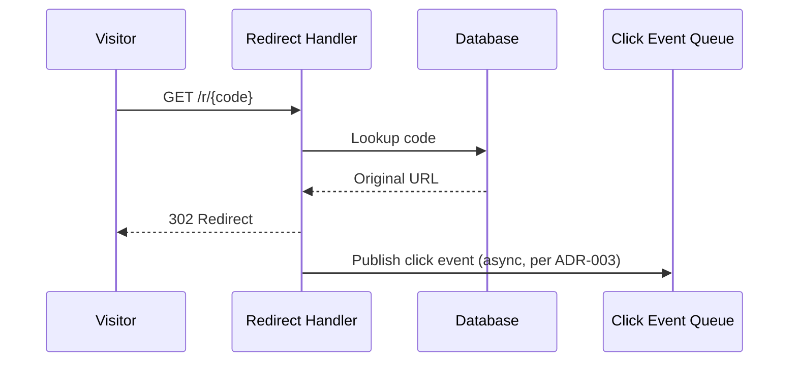

# Worked example: Project README — TeamLink (continued)

Derived from mermaid-diagrams v1.0 (see its worked example) and, via
`list-doc-types`, every other document type that exists for this project
at generation time (mini-prd, functional-requirements,
non-functional-requirements, architecture-design, mermaid-diagrams — no
sprints yet, so no Sprints row).

## The actual README.md produced (this is the file copied to the project root)

```markdown
# TeamLink URL Shortener

TeamLink lets small teams create shortened URLs for links they share
externally, and see how those links are performing. Built for teams who
need compact, trackable links without the overhead of a full marketing
platform.

## Documents

| Document | Current Version | |
|----------|------------------|---|
| Mini-PRD | v1.0 | [Browse versions](./mini-prd/) |
| Functional Requirements | v1.0 | [Browse versions](./functional-requirements/) |
| Non-Functional Requirements | v1.0 | [Browse versions](./non-functional-requirements/) |
| Architecture & Design | v1.0 | [Browse versions](./architecture-design/) |
| Diagrams | v1.0 | [Browse versions](./mermaid-diagrams/) |

Each link goes to that document's folder, where every version is
available — pick whichever one you need; this README always points at
the folder, not a single locked-in version.

## Diagrams

### Component Architecture

The Redirect Handler and Click Consumer components and their data/queue
dependencies.



### Request Flow

The redirect path through async click-event publication.



---

Generated by the `project-readme` skill. Project ID: `curious-mango`.
```

## The matching data.json

```json
{
  "document_id": "README-TEAMLINK-001",
  "product": "TeamLink URL Shortener",
  "version": "1.0",
  "created": "2026-01-18",
  "status": "READY",
  "mvp": {"number": 1, "is_final": false},
  "overview": "TeamLink lets small teams create shortened URLs for links they share externally, and see how those links are performing.",
  "included_documents": [
    {"doc_type": "mini-prd", "label": "Mini-PRD", "current_version": "1.0", "folder_path": "./mini-prd/"},
    {"doc_type": "functional-requirements", "label": "Functional Requirements", "current_version": "1.0", "folder_path": "./functional-requirements/"},
    {"doc_type": "non-functional-requirements", "label": "Non-Functional Requirements", "current_version": "1.0", "folder_path": "./non-functional-requirements/"},
    {"doc_type": "architecture-design", "label": "Architecture & Design", "current_version": "1.0", "folder_path": "./architecture-design/"},
    {"doc_type": "mermaid-diagrams", "label": "Diagrams", "current_version": "1.0", "folder_path": "./mermaid-diagrams/"}
  ],
  "diagrams_embedded": [
    {"filename": "01-component-architecture.mmd", "type": "container-architecture", "shows": "The Redirect Handler and Click Consumer components and their data/queue dependencies."},
    {"filename": "02-request-flow.mmd", "type": "sequence-diagram", "shows": "The redirect path through async click-event publication."}
  ]
}
```

Notice `included_documents` has exactly five entries because that's what
`list-doc-types` actually found for this project at this point — no
`sprints_included` field at all, not an empty array standing in for it,
since sprints don't exist yet. If this skill were re-run after a sprint
existed, that field would appear and a "Sprints" row would be added to
the table, without anything else in the document needing to change.
