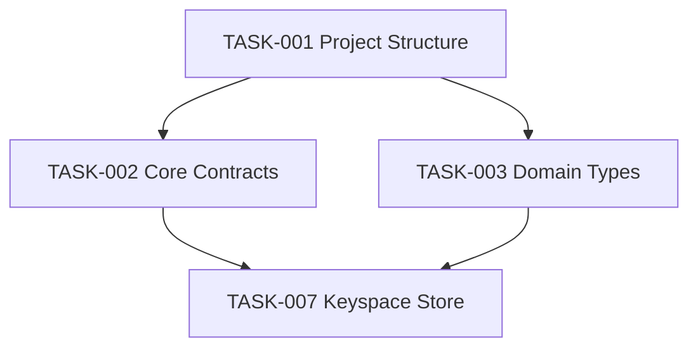

# Worked example: Sprint 1 — Mini Redis Foundation

Derived from functional-requirements, non-functional-requirements, and
architecture-design (all v1.0) for a Mini Redis server project. This
sprint establishes the foundation and the first storage component.

## Excerpt of the .md document

```markdown
# Sprint 1: Establish foundation and core keyspace store

Sprint Number: 1
Status: READY
Version: 1.0
Created: 2026-02-01

---

## Sprint Goal

Establish the project foundation (structure, contracts, domain types)
and deliver the first storage component (in-memory keyspace store) that
later command tasks will build on.

## Sprint Scope

- Go project structure and build infrastructure
- Core domain contracts (interfaces)
- Core domain types and invariants
- In-memory keyspace store

---

## TASK-001 — Project Structure

Status: NOT_STARTED
Workstream: WS-00 Foundation
Execution Mode: Sequential after prerequisites

### Prerequisites
None — this is a foundation task.

### Blocks
- TASK-002 — Core Contracts
- TASK-003 — Define Core Domain Types

### Start Condition
None — this is the first task.

### Implementation Scope

In scope:
- Go module initialization
- Package/directory layout
- Build and CI scaffolding

Out of scope:
- Any business logic

### Acceptance Criteria
- The repository builds successfully.
- CI runs and passes on an empty scaffold.

### Tests Required

**Test 1 — Build succeeds**
Purpose: Verify the scaffold compiles.
Steps:
1. Run `go build ./...`
Expected Result: Exit code 0, no errors.

### Definition of Done
- CI is green on the initial scaffold.

---

## TASK-007 — Implement In-Memory Keyspace Store

Status: NOT_STARTED
Workstream: WS-03 Keyspace
Execution Mode: Sequential after prerequisites

### Prerequisites
- TASK-001 — Project Structure
- TASK-002 — Core Contracts
- TASK-003 — Define Core Domain Types

### Blocks
- TASK-008 — SET
- TASK-009 — GET
- TASK-010 — DEL
- TASK-011 — EXISTS

### Start Condition
TASK-001, TASK-002, and TASK-003 must all be DONE.

### Implementation Scope

In scope:
- An in-memory key/value store
- Key lookup, insertion/update, deletion, existence checks
- Storage of expiration metadata required by later expiration tasks
- Clear domain-level behavior for missing keys
- Interfaces required by the command layer
- Unit-testable storage behavior without requiring a TCP server

Out of scope:
- RESP parsing or encoding
- TCP networking
- Authentication
- Persistence to disk, replication, distributed storage
- Expiration *execution* logic (metadata storage only — the expiration
  workstream owns execution)

### Source References
- Architecture & Technical Design: Data Architecture / Keyspace
- Architecture & Technical Design: Component Architecture
- ADR-2: Pure In-Memory Storage
- ADR-3: Fine-Grained Per-Key/Per-Shard Concurrency
- FR: Keyspace storage requirements
- NFR: Concurrency and performance requirements

### Acceptance Criteria
- The keyspace stores string keys and values in memory.
- A stored key can be retrieved by key.
- Existing keys can be updated.
- A missing key produces the defined missing-key behavior.
- A key can be deleted; the store can determine whether a key exists.
- Storage behavior does not depend on RESP or TCP.
- The implementation provides the interfaces required by subsequent
  command tasks.
- Unit tests cover normal and edge-case behavior.

### Tests Required

**Test 1 — Store New Key**
Purpose: Verify that a new key/value pair can be stored.
Steps:
1. Create a new empty keyspace.
2. Store key `foo` with value `bar`.
3. Retrieve `foo`.
Expected Result: The returned value is `bar`.

### Definition of Done
- All listed unit tests pass.
- No dependency on RESP or TCP exists in this component.

---

(TASK-002, TASK-003, and TASK-004 through TASK-006 follow the same
structure — trimmed here for length; see `templates/sprint.md`)

## Dependency Graph



## Parallel Execution

- TASK-002 and TASK-003 can run concurrently once TASK-001 is DONE.

## Sequential Gates

- TASK-001 — blocks the entire foundation workstream; nothing else in
  this sprint can start until it's DONE.

## Sprint Completion Criteria

- [ ] TASK-001 through TASK-007 are all DONE.
- [ ] CI is green.

## Completeness Assessment

Sprint status:
READY

Is this the final sprint? No — "Additional tasks remain for future
sprints" (SET/GET/DEL/EXISTS commands, expiration, concurrency).
```

## The matching data.json (excerpt — 4 of the sprint's tasks shown)

```json
{
  "document_id": "SPRINT-MINIREDIS-001",
  "product": "Mini Redis",
  "version": "1.0",
  "created": "2026-02-01",
  "sprint_number": 1,
  "status": "READY",
  "is_final_sprint": false,
  "input_documents": {
    "functional_requirements": {"version": "1.0", "validation": "PASS"},
    "non_functional_requirements": {"version": "1.0", "validation": "PASS"},
    "architecture_design": {"version": "1.0", "validation": "PASS"}
  },
  "sprint_goal": "Establish the project foundation and deliver the first storage component.",
  "sprint_scope": ["Go project structure", "Core contracts", "Core domain types", "In-memory keyspace store"],
  "tasks": [
    {
      "id": "TASK-001", "title": "Project Structure", "workstream": "WS-00 Foundation",
      "execution_mode": "Sequential after prerequisites",
      "prerequisites": [], "blocks": ["TASK-002", "TASK-003"],
      "start_condition": "None - this is the first task.",
      "source_references": ["Architecture: Deployment Architecture"],
      "scope_in": ["Go module init", "package layout", "CI scaffolding"],
      "scope_out": ["business logic"],
      "acceptance_criteria": ["The repository builds successfully.", "CI passes on an empty scaffold."],
      "tests_required": [{"name": "Build succeeds", "purpose": "Verify the scaffold compiles.", "steps": ["Run go build ./..."], "expected_result": "Exit code 0, no errors."}],
      "definition_of_done": ["CI is green on the initial scaffold."]
    },
    {
      "id": "TASK-002", "title": "Core Contracts", "workstream": "WS-00 Foundation",
      "execution_mode": "Parallel after prerequisites",
      "prerequisites": ["TASK-001"], "blocks": ["TASK-007"],
      "start_condition": "TASK-001 must be DONE.",
      "source_references": ["Architecture: Component Architecture"],
      "scope_in": ["Core interfaces"], "scope_out": ["Concrete implementations"],
      "acceptance_criteria": ["Interfaces compile.", "No implementation logic present."],
      "tests_required": [{"name": "Compile check", "purpose": "Verify interfaces compile.", "steps": ["Run go build ./..."], "expected_result": "Compiles cleanly."}],
      "definition_of_done": ["Merged and reviewed."]
    },
    {
      "id": "TASK-003", "title": "Define Core Domain Types", "workstream": "WS-00 Foundation",
      "execution_mode": "Parallel after prerequisites",
      "prerequisites": ["TASK-001"], "blocks": ["TASK-007", "TASK-012", "TASK-018"],
      "start_condition": "TASK-001 must be DONE.",
      "source_references": ["FR: domain entities"],
      "scope_in": ["Domain type definitions"], "scope_out": ["Storage behavior"],
      "acceptance_criteria": ["Types are defined and documented."],
      "tests_required": [{"name": "Unit test", "purpose": "Verify type invariants.", "steps": ["Run unit tests"], "expected_result": "All pass."}],
      "definition_of_done": ["Reviewed and merged."]
    },
    {
      "id": "TASK-007", "title": "Implement In-Memory Keyspace Store", "workstream": "WS-03 Keyspace",
      "execution_mode": "Sequential after prerequisites",
      "prerequisites": ["TASK-001", "TASK-002", "TASK-003"],
      "blocks": ["TASK-008", "TASK-009", "TASK-010", "TASK-011"],
      "start_condition": "TASK-001, TASK-002, and TASK-003 must all be DONE.",
      "source_references": ["ADR-2: Pure In-Memory Storage", "ADR-3: Fine-Grained Per-Key/Per-Shard Concurrency", "FR: Keyspace storage requirements", "NFR: Concurrency and performance requirements"],
      "scope_in": ["In-memory key/value store", "Key lookup/insert/update/delete/exists", "Expiration metadata storage"],
      "scope_out": ["RESP parsing", "RESP encoding", "TCP networking", "Authentication", "Persistence to disk", "Replication", "Expiration execution logic"],
      "acceptance_criteria": [
        "The keyspace stores string keys and values in memory.",
        "A stored key can be retrieved by key.",
        "Existing keys can be updated.",
        "A missing key produces the defined missing-key behavior.",
        "A key can be deleted.",
        "The store can determine whether a key exists.",
        "Storage behavior does not depend on RESP or TCP.",
        "Unit tests cover normal and edge-case behavior."
      ],
      "tests_required": [
        {"name": "Store New Key", "purpose": "Verify that a new key/value pair can be stored.", "steps": ["Create a new empty keyspace.", "Store key foo with value bar.", "Retrieve foo."], "expected_result": "The returned value is bar."}
      ],
      "definition_of_done": ["All listed unit tests pass.", "No dependency on RESP or TCP exists in this component."]
    }
  ],
  "sequential_gates": [
    {"task_id": "TASK-001", "note": "Blocks the entire foundation workstream; nothing else in this sprint can start until it's DONE."}
  ],
  "dependency_graph_diagram": "flowchart TD\n  TASK001-->TASK002\n  TASK001-->TASK003\n  TASK002-->TASK007\n  TASK003-->TASK007",
  "sprint_completion_criteria": ["TASK-001 through TASK-007 are all DONE.", "CI is green."],
  "open_questions": []
}
```

Notice `TASK-007`'s `prerequisites` names exactly the tasks whose
completion it needs (not just "foundation stuff in general"), and its
`blocks` names the specific downstream command tasks (SET/GET/DEL/EXISTS)
waiting on it — this specificity is what `task-status-init` and
`task-status-set --status DONE`'s cascade actually operate on. A vaguer
prerequisite ("foundation must be complete") wouldn't be machine-checkable.
