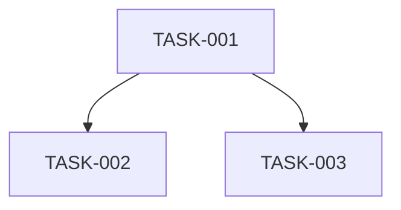

# Sprint <N>: <Sprint Goal, one line>

Sprint Number: <N>
Status: READY / BLOCKED
Version: [X.Y]
Created: [Date]

---

## Sprint Goal

[One concise statement of what this sprint accomplishes]

## Sprint Scope

- [Capability / component this sprint delivers]
- [Capability / component this sprint delivers]

## Task Lifecycle (applies to every task below)

```
┌──────────────┐
│ NOT READY    │
└──────┬───────┘
       │  prerequisites satisfied
       ▼
┌──────────────┐
│ READY        │
└──────┬───────┘
       │  engineer starts
       ▼
┌──────────────┐
│ IN PROGRESS  │
└──────┬───────┘
       │  complete
       ▼
┌──────────────┐
│ DONE         │
└──────────────┘
```

A task's live status is tracked separately from this document (see
`task-status-*` commands) — the status shown in each task's header below
is its status *as of when this sprint was written*, not a live value.

---

## TASK-NNN — <Title>

Status: NOT_STARTED / READY / IN_PROGRESS / DONE (as of authoring time)
Workstream: <category label, e.g. WS-00 Foundation>
Execution Mode: Sequential after prerequisites / Parallel after prerequisites

### Prerequisites
- TASK-NNN — <what it establishes>
(or "None — this is a foundation task" if empty)

### Blocks
- TASK-NNN — <what depends on this>
- TASK-NNN — <what depends on this>

### Start Condition
<Precise logic, e.g. "TASK-001 and TASK-002 must both be DONE.">

### Implementation Scope

In scope:
- [What to implement]

Out of scope:
- [What this task must NOT implement — and which later task owns it, if known]

### Source References
- [FR-N / NFR-N / ADR-N / Architecture section this task implements]

### Acceptance Criteria
- [Granular, unit-testable, independent of networking/protocol layers where applicable]

### Tests Required

**Test 1 — <name>**
Purpose: <what this verifies>
Steps:
1. [Step]
2. [Step]
Expected Result: <exact expected outcome>

### Definition of Done
- [Concrete, checkable condition]

---

## TASK-NNN — <Title>
...

---

## Dependency Graph



(or an ASCII equivalent — either is fine, but include one)

## Parallel Execution

Tasks that can run concurrently once their own prerequisites are
satisfied (this does NOT mean they can start at the same calendar time
regardless of prerequisites):
- TASK-NNN and TASK-NNN (once <shared prerequisite> is DONE)

## Sequential Gates

Foundation-milestone tasks that block significant downstream workstreams
— call these out explicitly, since they're the tasks most likely to
create a bottleneck if delayed:
- TASK-NNN — blocks N downstream tasks across M workstreams

## Sprint Completion Criteria

- [ ] All tasks in this sprint are DONE
- [ ] [Any additional sprint-level exit condition, e.g. CI green, integration test passing]

## Open Questions

- [Anything unresolved that doesn't block starting the sprint but should be tracked]

## Completeness Assessment

Sprint status:
READY

<or, if not:>

Sprint status:
BLOCKED

Blocking issues:
- [Specific gap that prevents this sprint plan from being usable as-is]

Is this the final sprint (no further implementation tasks remain across
the whole design)? Yes / No — if No: "Additional tasks remain for future
sprints."
